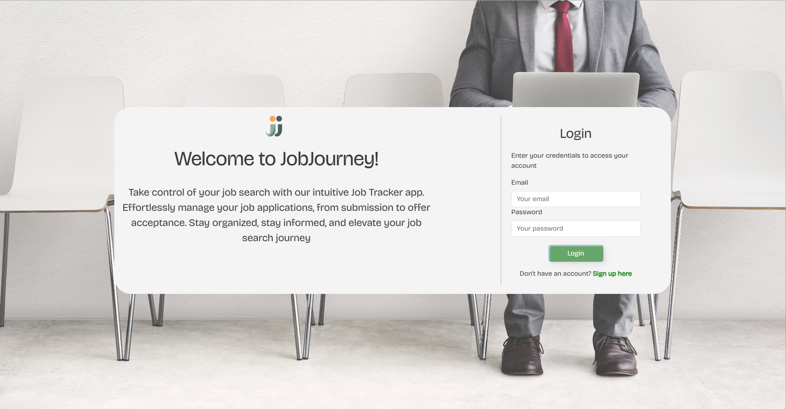

# JobJourney

</br>


</br>

---

##   📝 Description


---

</br>

Empower your job search with the user-friendly Job Tracker application. Seamlessly oversee your entire job application process, from initial submission to securing the offer. Keep your job search organized and stay well-informed every step of the way. This dynamic app showcases the implementation of React, GraphQL, and MongoDB, hosted on Heroku. It represents the successful culmination of our boot camp journey, highlighting our skills and dedication to creating impactful, practical solutions. Welcome to a new era of efficient job hunting!

</br>

---


##   ⌨️ Programming Languages & Technologies
---

</br>

<div style="display: inline_block">

[](https://devdocs.io/html/)
&nbsp;&nbsp;
[](https://devdocs.io/css/)
&nbsp;&nbsp;
[](https://devdocs.io/javascript/)
&nbsp;&nbsp;
[](https://nodejs.org/en/docs)
&nbsp;&nbsp;

&nbsp;&nbsp;

&nbsp;&nbsp;

&nbsp;&nbsp;

</div>

</br>


---

## 📑 Table of Contents

---

</br>

- [Installation](#💿-installation)
- [Usage](#💻-usage)
- [License](#🔏-license)
- [Credits](#🖋️-credits)
- [Tests](#🧪-tests)
- [User Story](#✍️-user-story)
- [Acceptance Criteria](#👏-acceptance-criteria)


</br>


---

##  💿 [Installation](#📑-table-of-contents)

---

</br>

1. Fork and clone repository to local machine 
2. Run `npm i` to install dependencies in local project directory


</br>


---

##   💻 [Usage](#📑-table-of-contents)

---

</br>

1. Open integrated terminal
2. Run `npm run build` to bundle React in production mode
3. Run `npm run start` to initiate the app in localhost
4. Click on the generated local port link
5. Alternatively, you can visit the deployed app in [Heroku](https://ancient-everglades-97703-e6a603057067.herokuapp.com/)


</br>

The github URL containing the code for this project is located at:

https://github.com/1alyciaoliveira/JobJourney/

</br>


Deployed Application Page:

https://ancient-everglades-97703-e6a603057067.herokuapp.com/


</br>




</br>


---

##  🔏 [License](#📑-table-of-contents)

---

</br>


 This project is licensed under the terms of the `MIT` license. 


</br>


---

## 🖋️ [Credits](#📑-table-of-contents)

---

</br>


- [1alyciaoliveira](https://github.com/1alyciaoliveira)
- [AlexTrejo92](https://github.com/AlexTrejo92)
- [JessFarron](https://github.com/JessFarron)
- [Maelikah](https://github.com/Maelikah/)
- [MariaFernandaMarroquin](https://github.com/MariaFernandaMarroquin)
- [Nellyfabela](https://github.com/nellyfabela)


</br>


---

##   🧪 [Tests](#📑-table-of-contents)

---

</br>


NA


</br>


---

## ✍️ [User Story](#📑-table-of-contents)

---

</br>

```md
As a job seeker,
I want to efficiently manage and track my job applications,
So that I can stay organized and informed throughout my job search journey.
```


</br>

---

## 👏 [Acceptance Criteria](#📑-table-of-contents)

---

</br>


```md
Given that I am a user of the app,
When I log in to the app with my credentials,
Then I should be redirected to my personalized dashboard.

Given that I am on the dashboard,
When I click on the "Add New Application" button,
Then I should be able to enter details such as job title, company, application date, and job description.

Given that I have added an application,
When I view my list of applications,
Then I should see a clear overview of all my applications with key details.

Given that I am viewing my list of applications,
When I click on an application,
Then I should be able to see the full application details and any notes I've added.

Given that I am viewing an application,
When I want to update the application status (e.g., applied, interview scheduled, offer received, rejected),
Then I should be able to change the status easily.

Given that I am viewing an application,
When I want to add notes about the application or any upcoming interviews,
Then I should be able to add, edit, and delete notes.

Given that I want to keep track of interviews and follow-ups,
When I receive updates or schedule changes,
Then I should be able to edit the application details and notes accordingly.

Given that I want to keep my data secure,
When I use the app,
Then my personal information and application details should be stored securely and accessible only to me.

Given that I have successfully secured a job offer,
When I change the status of an application to "Accepted Job" or similar,
Then I should be able to mark the application as closed and provide additional details if needed.

Given that I want to have an overview of my job search progress,
When I access the dashboard,
Then I should be able to see visual representations of application status distribution and a timeline of application activities.

Given that I want to transition to other sections of the app,
When I use the navigation menu,
Then I should be able to easily access features like settings and any additional tools.

Given that the app is being used collaboratively or across multiple devices,
When updates are made to applications,
Then the app should sync in real-time or provide a reliable method to ensure consistent data across all instances.  
```

</br>


---

[Back to Top](#jobjourney)
